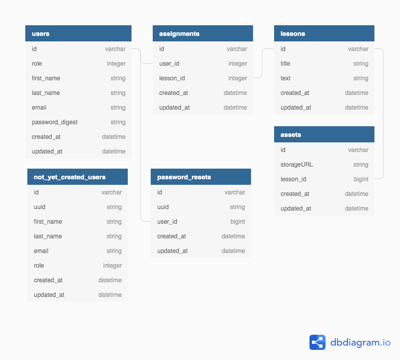

## Overview
This is a database-backed web service API for a music education application. It has been developed in response to music teachers who have expressed difficulty in making audio and video files easily accessible to students.

This API needs to be consumed by a client-side application in order to make the functionality available to end-users. An example of a client-side application that consumes this API can be found at [music-learning-client](https://github.com/nickedwards109/music-learning-client).

An end-user of the application can be an admin, a teacher, or a student.

Admins can create teachers and students.

Teachers can create lessons. A lesson has a title, text, and an asset that can be a video file or audio file where a teacher can demonstrate techniques to students.

Teachers can assign lessons to students.

Students can view lessons that have been assigned to them. This gives them access to the audio or video file that is a part of the lesson, enhancing their learning experience and making the teacher's job easier.

This application is a work in progress. Please check back later for more updates!

## Database Schema Visualization

## Authentication
### Transport Layer Security
The security of this authentication scheme relies on encryption at the transport layer. In order to prevent an eavesdropper from gaining access to credentials, the client must access the web service over HTTPS. One approach for doing this would be to first deploy the web service on an Amazon EC2 instance over HTTP, and then configure Amazon API Gateway to supply HTTPS endpoints that proxy requests over Amazon's secure network between the client and the EC2 instance.

### JSON Web Tokens
Most endpoints in this web service require a JSON web token as the value of a header called TOKEN.

This token is contained in the response of a successful **POST /api/v1/sessions** request where a client supplies a valid username and password combination in the query parameters. The token contains three parts, each separated by a period character and joined together to make a single string. The three parts are:

1. Headers  
There is only one header, which indicates that SHA256 is the hashing algorithm for generating a signature:  
"{"alg":"HS256"}"  

2. Payload  
The payload indicates the primary key of the user, and the role of the user. For example:  
"{"id":11,"role":"teacher"}"

3. Signature  
The signature is a SHA256 digest generated by initializing a digest with the Rails secret key base and then updating it with the payload. When a JSON web token is later supplied by the client to authenticate a request, the server re-generates a signature from the secret key base and the payload provided by the client; if the resulting signature matches the signature provided by the client, the signature provided by the client is considered to be valid and the request is successfully authenticated.

Some endpoints do not require a JSON web token, and these are noted in the individual endpoint documentation below.

## Endpoints

**POST /api/v1/sessions**  
This endpoint enables the client to authenticate and get a JSON web token to include in future requests. The client must supply query parameters for a valid username and password combination, nested under a session key. The query string could look like:  
/api/v1/sessions?session[username]=\<string\>&session[password]=\<string\>  

The body of a 200 response is a JSON string containing a JSON web token that can be included in the headers of future requests to authenticate with other endpoints:  
{  
&nbsp;&nbsp;token: string  
}  

**GET  /api/v1/lessons**  
This is the endpoint for getting an index of all lessons. The client must supply in the request headers a JSON web token with a valid signature to access this endpoint. The body of a 200 response is a JSON string containing a collection of lessons, each element containing the lesson's id, title, text, and timestamps:  
{  
&nbsp;&nbsp;lessons: {  
&nbsp;&nbsp;&nbsp;&nbsp;{  
&nbsp;&nbsp;&nbsp;&nbsp;&nbsp;&nbsp;id: integer,  
&nbsp;&nbsp;&nbsp;&nbsp;&nbsp;&nbsp;title: string,  
&nbsp;&nbsp;&nbsp;&nbsp;&nbsp;&nbsp;text: string,  
&nbsp;&nbsp;&nbsp;&nbsp;&nbsp;&nbsp;created_at: datetime,  
&nbsp;&nbsp;&nbsp;&nbsp;&nbsp;&nbsp;updated_at: datetime  
&nbsp;&nbsp;&nbsp;&nbsp;}  
&nbsp;&nbsp;}  
}

**POST /api/v1/lessons**  
This is the endpoint for creating a new lesson. The client must supply in the request headers a JSON web token with a valid signature to access this endpoint. The query parameters must contain a lesson key. Nested under the lesson key must be the title and text attributes of the lesson, as well as an assets_attributes key under which must be nested the storageURL attribute of the lesson's associated asset. The query string could look like:  
/api/v1/lessons?lesson[title]=\<string\>&lesson[text]=\<string\>&lesson[assets_attributes][storageURL]=\<string\>  

A response to a successful request has a 200 status code and a body that is a JSON string containing the newly created lesson's id:  
{  
&nbsp;&nbsp;lesson_id: integer  
}  

**GET  /api/v1/lessons/:id**  
This is the endpoint for getting a single lesson. The client must supply in the request headers a JSON web token with a valid signature to access this endpoint. The client must include the primary key of the lesson as a path variable. The body of a 200 response is a JSON string containing the lesson's id, title, text, and timestamps, as well as an assets key under which is nested a collection of the lesson's associated asset objects:  
{  
&nbsp;&nbsp;id: integer,  
&nbsp;&nbsp;title: string,  
&nbsp;&nbsp;text: string,  
&nbsp;&nbsp;created_at: datetime,  
&nbsp;&nbsp;updated_at: datetime,  
&nbsp;&nbsp;assets: [  
&nbsp;&nbsp;&nbsp;&nbsp;{  
&nbsp;&nbsp;&nbsp;&nbsp;&nbsp;&nbsp;id: integer,  
&nbsp;&nbsp;&nbsp;&nbsp;&nbsp;&nbsp;storageURL: string,  
&nbsp;&nbsp;&nbsp;&nbsp;&nbsp;&nbsp;lesson_id: integer,  
&nbsp;&nbsp;&nbsp;&nbsp;&nbsp;&nbsp;created_at: datetime,  
&nbsp;&nbsp;&nbsp;&nbsp;&nbsp;&nbsp;updated_at: datetime,  
&nbsp;&nbsp;&nbsp;&nbsp;},  
&nbsp;&nbsp;&nbsp;&nbsp;{  
&nbsp;&nbsp;&nbsp;&nbsp;&nbsp;&nbsp;id: integer,  
&nbsp;&nbsp;&nbsp;&nbsp;&nbsp;&nbsp;storageURL: string,  
&nbsp;&nbsp;&nbsp;&nbsp;&nbsp;&nbsp;lesson_id: integer,  
&nbsp;&nbsp;&nbsp;&nbsp;&nbsp;&nbsp;created_at: datetime,  
&nbsp;&nbsp;&nbsp;&nbsp;&nbsp;&nbsp;updated_at: datetime,  
&nbsp;&nbsp;&nbsp;&nbsp;},  
&nbsp;&nbsp;]  
}  

**GET  /api/v1/assignments**  
This is the endpoint for getting an index of lessons that have been assigned to a particular student. The client must supply in the request headers a JSON web token with a valid signature to access this endpoint. The client must supply query parameters containing a student id. The query string could look like:
/api/v1/assignments?student_id=\<integer\>  

The body of a 200 response is a JSON string containing a collection of assigned lessons, each element containing the lesson's id, title, text, and timestamps:  
{  
&nbsp;&nbsp;lessons: {  
&nbsp;&nbsp;&nbsp;&nbsp;{  
&nbsp;&nbsp;&nbsp;&nbsp;&nbsp;&nbsp;id: integer,  
&nbsp;&nbsp;&nbsp;&nbsp;&nbsp;&nbsp;title: string,  
&nbsp;&nbsp;&nbsp;&nbsp;&nbsp;&nbsp;text: string,  
&nbsp;&nbsp;&nbsp;&nbsp;&nbsp;&nbsp;created_at: datetime,  
&nbsp;&nbsp;&nbsp;&nbsp;&nbsp;&nbsp;updated_at: datetime  
&nbsp;&nbsp;&nbsp;&nbsp;}  
&nbsp;&nbsp;}  
}

**POST /api/v1/assignments**  
This is the endpoint for assigning a lesson to a student, or in other words, creating an assignment as a join record joining a lesson and a student. The client must supply in the request headers a JSON web token with a valid signature to access this endpoint. The client must supply query parameters with an assignments key, under which must be nested the primary key of the student and the primary key of the lesson. The query string could look like:  
/api/v1/assignments?assignment[user_id]=\<integer\>&assignment[lesson_id]=\<integer\>  

A response to a successful request has a 200 status code and an empty body.

**GET  /api/v1/students**  
This is the endpoint for getting an index of all students. The client must supply in the request headers a JSON web token with a valid signature to access this endpoint. The body of a 200 response is a JSON string containing a students key under which is nested a collection of students, each element containing the student's id, first name, last name, and email address:  
{  
&nbsp;&nbsp; students: [  
&nbsp;&nbsp;&nbsp;&nbsp;{  
&nbsp;&nbsp;&nbsp;&nbsp;&nbsp;&nbsp;id: integer,  
&nbsp;&nbsp;&nbsp;&nbsp;&nbsp;&nbsp;first_name: string,  
&nbsp;&nbsp;&nbsp;&nbsp;&nbsp;&nbsp;last_name: string,  
&nbsp;&nbsp;&nbsp;&nbsp;&nbsp;&nbsp;email: string,  
&nbsp;&nbsp;&nbsp;&nbsp;&nbsp;&nbsp;},  
&nbsp;&nbsp;&nbsp;&nbsp;{  
&nbsp;&nbsp;&nbsp;&nbsp;&nbsp;&nbsp;id: integer,  
&nbsp;&nbsp;&nbsp;&nbsp;&nbsp;&nbsp;first_name: string,  
&nbsp;&nbsp;&nbsp;&nbsp;&nbsp;&nbsp;last_name: string,  
&nbsp;&nbsp;&nbsp;&nbsp;&nbsp;&nbsp;email: string,  
&nbsp;&nbsp;&nbsp;&nbsp;&nbsp;&nbsp;}  
&nbsp;&nbsp;]  
}  

**POST /api/v1/send-new-user-email**  
This endpoint triggers an email to a new user that enables the new user to follow a link to a form where they can set their new password. The client must supply in the request headers a JSON web token with a valid signature to access this endpoint. The client must supply query parameters containing a user key, under which must be nested the student's first name, last name, and email address. The query string could look like:  
/api/v1/send-new-user-email?user[first_name]=\<string\>&user[last_name]=\<string\>&user[email]=\<string\>  

A response to a successful request has a 200 status code and an empty body.

**POST /api/v1/set-password**  
This is the endpoint where a new user's set password form should be submitted to. This endpoint does not require a JSON web token from the client. Instead, the query parameters must contain a UUID (universally unique identifier) equal to a UUID in the not_yet_created_users table. This UUID is first created when a request to **POST /api/v1/send-new-user-email**  is made, which creates a NotYetCreatedUser record that has a UUID, and the UUID is included in the URL in the password setting email sent to the new user. The client can get this UUID out of the URL when the user visits it to set their password, and the client must pass in the UUID in the request to **POST /api/v1/set-password**. Query parameters must contain a user key, under which must be nested a password, password confirmation, and UUID. The query string could look like:  
/api/v1/set-password?user[password]=\<string\>&user[password_confirmation]=\<string\>&user[uuid]=\<string\>  

A response to a successful request has a 204 status code and an empty body.

**POST /api/v1/initiate-password-reset**  
This is the endpoint for triggering an email to a user in order for them to reset their password. It triggers the creation of a record in the password_resets table with the user's primary key under the user_id attribute as well as a UUID, both of which can be looked up later for actually re-setting the user's password. This endpoint does not require a JSON web token from the client. The query parameters must contain a user key, under which must be nested the user's email address:  
/api/v1/initiate-password-reset?user[email]=\<string\>  

A response to a successful request has a 204 status code and an empty body.

**POST /api/v1/reset-password**  
This is the endpoint for resetting a user's password. This endpoint does not require a JSON web token from the client. Instead, the query parameters must contain a UUID (universally unique identifier) equal to a UUID in the password_resets table. This UUID is first created when a request to **POST /api/v1/initiate-password-reset**  is made, which creates a PasswordReset record that has a UUID, and the UUID is included in the URL in the password resetting email sent to the user. The client can get this UUID out of the URL when the user visits it to reset their password, and the client must pass in the UUID in the request to **POST /api/v1/reset-password**. Query parameters must contain a user key, under which must be nested a password, password confirmation, and UUID. The query string could look like:  
/api/v1/reset-password?user[password]=\<string\>&user[password_confirmation]=\<string\>&user[uuid]=\<string\>  

A response to a successful request has a 204 status code and an empty body.

**POST /api/v1/presigned-upload-url**  
This endpoint enables the client to request an Amazon S3 upload URL, pre-signed by AWS, enabling the client as the bearer of the URL to POST to it in order to upload an asset to an S3 bucket. The client must supply in the request headers a JSON web token with a valid signature to access this endpoint. The client does not need to supply any query parameters in the request. The body of a 200 response is a JSON string containing a pre-signed S3 upload URL as well as several fields which are defined in the [AWS Ruby SDK documentation](https://docs.aws.amazon.com/sdk-for-ruby/v2/api/Aws/S3/PresignedPost.html).  
{  
&nbsp;&nbsp;url: string,  
&nbsp;&nbsp;fields: string  
}

**GET  /api/v1/admin/dashboard**  
This is the endpoint for getting data to display in an admin's dashboard. The client must supply in the request headers a JSON web token with a valid signature to access this endpoint. The JSON web token payload must also contain the admin's primary key, nested under an id key:  
{  
&nbsp;&nbsp;id: integer  
}  
The body of a 200 response is a JSON string containing the admin user's first name:  
{  
&nbsp;&nbsp;firstName: string  
}  

**GET  /api/v1/teacher/dashboard**  
This is the endpoint for getting data to display in a teacher's dashboard. The client must supply in the request headers a JSON web token with a valid signature to access this endpoint. The JSON web token payload must also contain the teacher's primary key, nested under an id key:  
{  
&nbsp;&nbsp;id: integer  
}  
The body of a 200 response is a JSON string containing the teacher's first name:  
{  
&nbsp;&nbsp;firstName: string  
}  

**GET  /api/v1/student/dashboard**  
This is the endpoint for getting data to display in a student's dashboard. The client must supply in the request headers a JSON web token with a valid signature to access this endpoint. The JSON web token payload must also contain the student's primary key, nested under an id key:  
{  
&nbsp;&nbsp;id: integer  
}  
The body of a 200 response is a JSON string containing the student's first name:  
{  
&nbsp;&nbsp;firstName: string  
}  

## Running the specs
As of the time of writing, there are 41 specifications that all pass. To run the specs, run:  
`$ rspec spec`

## Deployment guide
...coming soon!
